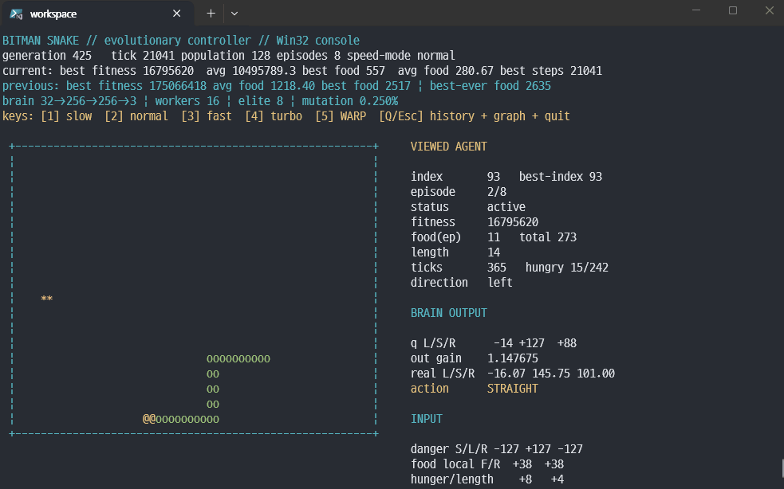
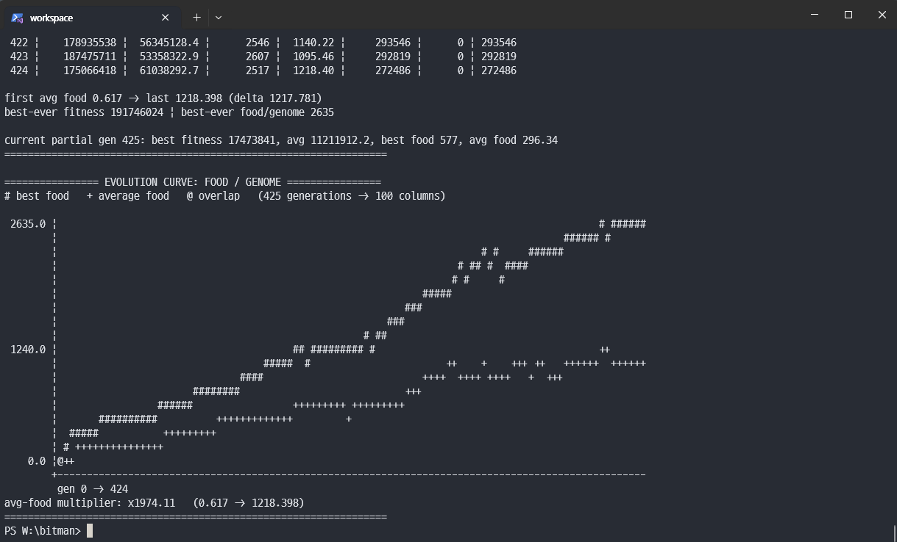

# bitman

The network uses ternary weights (`-1, 0, 1`) inspired by [BitLinear](https://github.com/schneiderkamplab/bitlinear).

I originally started this after looking for ways to train quantized networks without maintaining full-precision shadow weights. Instead of forcing backpropagation onto it, I went with evolutionary search.

Some of the BitLinear implementation was adapted from my earlier experiment:
[`stoneagemodel`](https://github.com/Haeryu/self_hackathon/tree/master/date20260816/stoneagemodel).

The snake environment and evolutionary approach were inspired by [Learning to Fly](https://pwy.io/posts/learning-to-fly-pt1/).
main.zig is vibe coded

## Run

```sh
zig build run -Doptimize=ReleaseFast
```

## Screenshots



